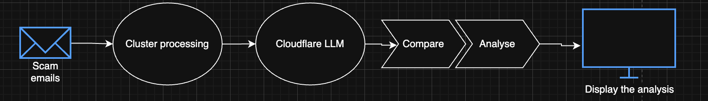

# 🚀 Scam Email Intelligence Dashboard  
### *AI-powered clustering, scam detection, and SOC-grade analytics.*

---

# 📌 Overview

The **Scam Email Intelligence Dashboard** is an end-to-end AI system that:

### 🔍 1. Clusters emails  
Using **SentenceTransformer → UMAP → HDBSCAN** for powerful semantic grouping.

### 🤖 2. Detects scam archetypes  
Via **Cloudflare Workers AI**, identifying:
- Financial Fraud  
- Government / Legal  
- Extortion / Urgency  
- Credential Harvesting  
- Social Engineering  
- Subscription Scams  
…and more.

### 🧠 3. SOC-friendly Analyst Dashboard  
Built with React + Tailwind for:
- Interactive filtering  
- Live risk scoring  
- Pagination  
- Scam highlighting  
- Cluster exploration  

---

# 🛡️ **⚠️ Safety & Ethical Use Notes**

This project processes **email content** and performs automated scam classification.  
It must be used **responsibly**, especially in enterprise or research contexts.

### ✅ **Intended Use**
This system is designed for:
- Cybersecurity research  
- SOC analyst workflows  
- Scam prevention and early detection  
- Educational / academic hackathons  
- Threat intelligence prototyping  

### ❌ **Not Intended For**
- Bulk surveillance of private communications  
- Monitoring individuals without consent  
- Automated law enforcement decision-making  
- Blocking legitimate users based solely on the model  
- Any real-world deployment without human oversight  

### ⚠️ **Model Limitations**
- Cloudflare AI outputs are **predictions**, not facts  
- Clustering may group unrelated emails  
- False positives and false negatives are possible  
- Outputs should be treated as **supporting intelligence**, not final judgement  

### 👥 **Human-in-the-Loop Required**
All scam detections must be **reviewed by a human analyst**.  
The dashboard is meant to **augment**, not replace human decision-making.

### 🔒 **Data Handling & Privacy**
- No emails are stored on the backend  
- All processing occurs **locally** in memory per request  
- Uploads are not logged or saved  
- No user-identifying data is shared with Cloudflare (only text fields required for analysis)

### 📄 **Compliance**
While this is a hackathon project, the design aligns with:
- GDPR guidelines (minimised personal data usage)  
- CCPA principles (no selling or storing personal info)  
- CIS Control 13 / SOC processes (Threat Detection)  

A real deployment would require:
- Data minimisation policies  
- Security reviews  
- Signed consent / user agreements  
- Not sending PII to external LLMs  

---

# 🔗 API Documentation  
➡ **Full API Spec:**  
https://github.com/CharlieSierra1/mq-apate-2025-team35/blob/varun/cluster_Backend/backend/APIDOC.md

---

# 🏗️ System Architecture

